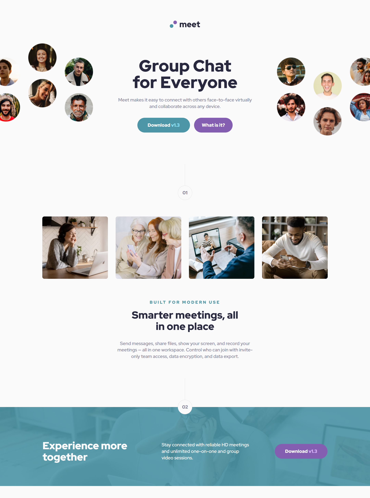

# Frontend Mentor - Meet landing page solution

This is a solution to the [Meet landing page challenge on Frontend Mentor](https://www.frontendmentor.io/challenges/meet-landing-page-rbTDS6OUR). Frontend Mentor challenges help you improve your coding skills by building realistic projects.

## Table of contents

-   [Overview](#overview)
    -   [The challenge](#the-challenge)
    -   [Screenshot](#screenshot)
    -   [Links](#links)
-   [Setup & Usage](#setup--usage)
-   [My process](#my-process)
    -   [Built with](#built-with)
    -   [What I learned](#what-i-learned)
    -   [Continued development](#continued-development)
    -   [Useful resources](#useful-resources)
-   [Author](#author)

## Overview

### The challenge

Users should be able to:

-   View the optimal layout depending on their device's screen size
-   See hover states for interactive elements

### Screenshot

### Links

-   Repository URL: [GitHub](https://github.com/moadavou/meet-landing-page)
-   Live Site URL: [GitHub Pages](https://moadavou.github.io/meet-landing-page/)

## Setup & Usage

After you clone this repo to your desktop, go to its root directory and run `npm install` to install its dependencies.

Once the dependencies have been installed, you can run `npm start` to access the website's live server in your browser. You will then be able to access it at [localhost:3000](http://localhost:3000).

When the project is ready for deployment, run `npm run build` to compile the scss and sass files to css, minimize, autoprefix, and purge unwanted classes.

## My process

### Built with

-   Semantic HTML5 markup
-   CSS custom properties
-   Flexbox
-   CSS Grid
-   Mobile-first workflow

*   [CUBE CSS](https://cube.fyi/) - CSS methodology
*   [Sass](https://sass-lang.com/) _(v1.77.2)_ - CSS pre-processor

### What I learned

I challenged myself with this project and decided to learn how to use **Sass**, **Node.js**, and how to create **package.json** files.

My biggest challenges were understanding package.json files, organizing and structuring my CSS, and implementing PostCSS. I changed my mind multiple times and had to do a lot of research regarding other people's solutions.

_As for the actual code,_ I improved my skills in grid, accessibility, and responsive layouts. The overflow in the hero section was particularly challenging.

### Continued development

I want to continue working with **Sass** and **Node.js** for a while to develop these skills further. It also feels like a more professional workflow.

In addition, I need to do some more reading about grid. It took me a long time to find a simple solution because I had forgotten some syntax. Next time I will be thorough in my research to save time in the long run.

### Useful resources

-   [Stop using an extension to compile Sass](https://www.youtube.com/watch?v=o4cECvhrBo8) - A video guide by Kevin Powell on how to install Sass with Node.js and why this is preferable over using extensions.
-   [Minimum Static Site Setup with Sass](https://thinkdobecreate.com/articles/minimum-static-site-sass-setup/) - A package.json file created by Stephanie Eckles. I used this one as inspiration when creating my package.json for this project.
-   [Sass Guidelines (Architecture)](https://sass-guidelin.es/#architecture) - A guide to structuring your Sass partials. This was very helpful for getting started.
-   [Getting started with Sass](https://www.youtube.com/playlist?list=PL4-IK0AVhVjMYRhK9vRPatSlb-9r0aKgh) - This collection of videos by Kevin Powell helped me understand Sass.

## Author

-   Frontend Mentor - [@moadavou](https://www.frontendmentor.io/profile/moadavou)
-   LinkedIn - [@moadavou](https://www.linkedin.com/in/moadavou/)
